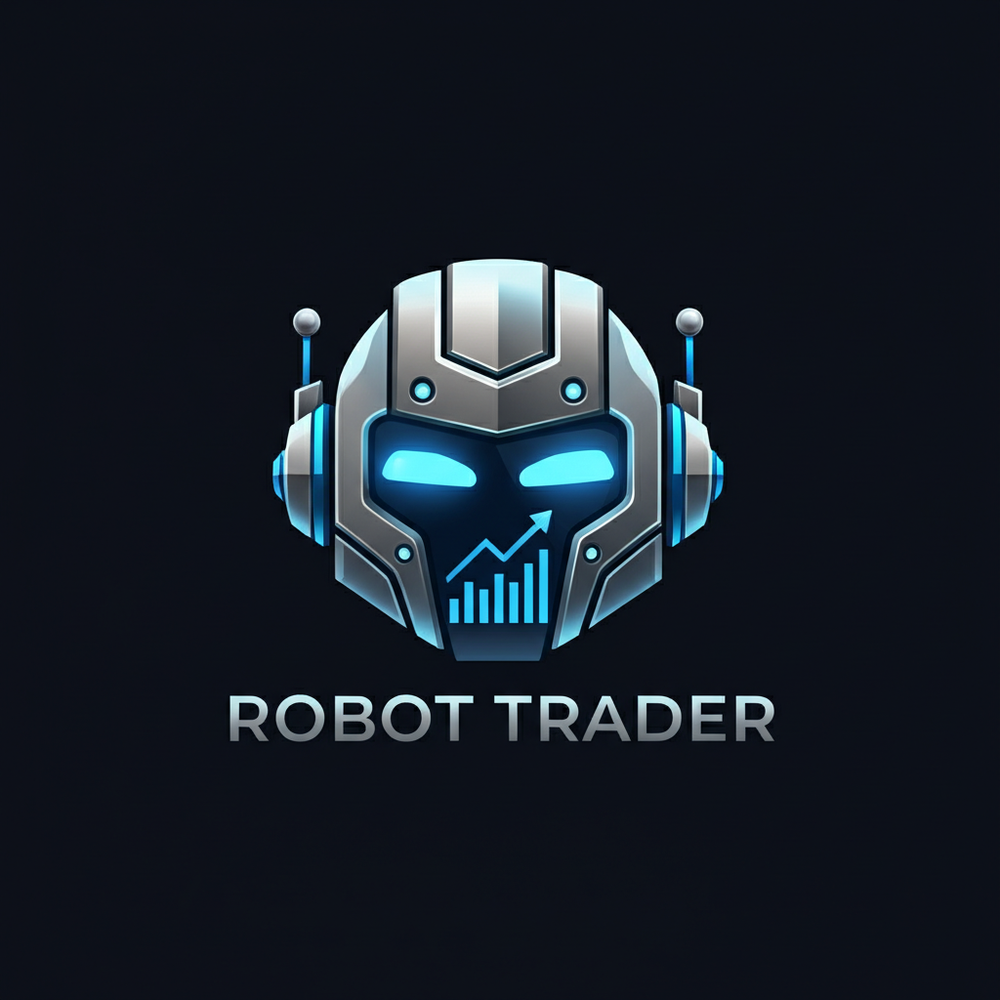

# Crestbot

Crestbot is a modern, TypeScript-first trading dashboard focused on the Indian markets (NSE/BSE). It provides real-time market data visualization, order management, bot configuration, backtesting utilities, and an operator-friendly UI.

Built with the Next.js App Router, Tailwind CSS, and shadcn/ui components, Crestbot is designed to be fast, accessible, and extensible.

---

## Table of Contents

- Overview
- Key Features
- Screenshots
- Prerequisites
- Installation
- Environment Variables
- Running the App
- Usage Guide
- Project Structure
- API Endpoints
- Development Notes
- Contributing
- Roadmap
- Acknowledgments
- Security and Disclaimer
- Troubleshooting

---

## Overview

Crestbot aims to streamline day-to-day trading operations with a unified interface for:

- Monitoring live quotes and price action
- Reviewing positions and orders
- Configuring and supervising trading bots
- Running backtests and inspecting logs
- Placing orders via a broker integration

It targets minimal cognitive overhead with a clean layout, sticky navigation, responsive design, and keyboard-friendly controls.

---

## Key Features

- Global navigation with responsive layout for desktop and mobile
- Market overview and sentiment (Fear & Greed)
- Ticker tape with smooth animations
- India stock list with streaming quotes (NSE/BSE)
- Candlestick chart, order book, and trades feed
- Order form and consolidated Orders view
- Position summary and PnL snapshots
- Bot settings panel (strategy parameters and toggles)
- Backtest panel with results and metrics
- Logs panel for operational transparency
- Theming support (light/dark), with plans for persisting preferences

---

## Screenshots

You can replace these placeholders with real screenshots when available.

- Dashboard  
  
- App Logo  
  

---

## Prerequisites

- Node.js 20 or newer
- A package manager (npm, pnpm, or yarn)
- An account and API credentials with your broker if you intend to place live/paper orders (e.g., Angel)

If you only want to explore the UI and local data flows, broker credentials are optional.

---

## Installation

1) Clone the repository  
\`\`\`bash
git clone https://github.com/<your-org-or-user>/crestbot.git
cd crestbot
\`\`\`

2) Install dependencies  
Choose one package manager:

- npm:  
  \`\`\`bash
  npm install
  \`\`\`

- pnpm:  
  \`\`\`bash
  pnpm install
  \`\`\`

- yarn:  
  \`\`\`bash
  yarn
  \`\`\`

3) Configure environment variables  
Create a file named `.env.local` in the project root and add the variables described below.

---

## Environment Variables

Add these to `.env.local`:

- Required for broker order placement (server-only):
  - \`ANGEL_API_KEY\` — Your Angel API key
  - \`ANGEL_SECRET_KEY\` — Your Angel API secret

- Optional (client-visible configuration):
  - \`NEXT_PUBLIC_DEFAULT_MARKET\` — Default market on load. Example: \`NSE\` or \`BSE\`
  - \`NEXT_PUBLIC_DEFAULT_THEME\` — Default theme. Example: \`light\` or \`dark\`

Example `.env.local`:

\`\`\`bash
# Broker credentials (server-side)
ANGEL_API_KEY=your_angel_api_key
ANGEL_SECRET_KEY=your_angel_secret_key

# UI configuration (client-side)
NEXT_PUBLIC_DEFAULT_MARKET=NSE
NEXT_PUBLIC_DEFAULT_THEME=dark
\`\`\`

Important:
- Never commit real secrets. Keep them out of version control.
- Server-side secrets must not be exposed to client-side code.

---

## Running the App

- Development
  \`\`\`bash
  # npm
  npm run dev

  # pnpm
  pnpm dev

  # yarn
  yarn dev
  \`\`\`
  Open http://localhost:3000 in your browser.

- Production (local)
  \`\`\`bash
  # npm
  npm run build && npm run start

  # pnpm
  pnpm build && pnpm start

  # yarn
  yarn build && yarn start
  \`\`\`

---

## Usage Guide

- Navigation  
  Use the top navbar to switch between:
  - Home (market overview, watchlists, charts, order flow)
  - Orders
  - Bot Settings
  - Logs
  - Backtest

- Market Switching  
  Use the Market Switcher to toggle between NSE and BSE lists.

- Live Data  
  India quotes are streamed via a server route and rendered in the stock list and ticker tape. The chart, order book, and trades feed update in near real time.

- Orders  
  Place orders using the order form. Open Orders/History are listed on the Orders page. Review PnL and execution details as they update.

- Bot Settings  
  Configure and toggle strategies. Adjust risk parameters, timeframes, or symbols as implemented by your strategy modules.

- Backtesting  
  Run backtests and review summarized metrics and logs in the Backtest section.

- Logs  
  Use the Logs view for operational transparency and troubleshooting.

---

## Project Structure

A simplified structure to orient yourself:

\`\`\`text
.
├─ app/
│  ├─ api/
│  │  ├─ broker/
│  │  │  └─ order/route.ts        # Places orders through broker adapter
│  │  └─ india/stream/route.ts    # Streams quotes (SSE) for India markets
│  ├─ backtest/page.tsx
│  ├─ bot-settings/page.tsx
│  ├─ logs/page.tsx
│  ├─ orders/page.tsx
│  ├─ layout.tsx                   # Global layout & navbar
│  └─ page.tsx                     # Home dashboard
├─ components/
│  ├─ nav-header.tsx
│  ├─ market-switcher.tsx
│  ├─ market-overview.tsx
│  ├─ ticker-tape.tsx
│  ├─ candle-chart.tsx
│  ├─ order-book.tsx
│  ├─ trades-feed.tsx
│  ├─ order-form.tsx
│  ├─ orders-tables.tsx
│  ├─ position-summary.tsx
│  ├─ india-stock-list.tsx
│  ├─ backtest-panel.tsx
│  ├─ bot-settings.tsx
│  ├─ logs-panel.tsx
│  └─ fear-greed.tsx
├─ hooks/
│  ├─ use-india-quotes.ts
│  └─ use-toast.ts
├─ lib/
│  ├─ brokers/adapters.ts          # Broker integration (e.g., Angel)
│  └─ utils.ts
├─ public/
│  ├─ robot-trader-logo.png
│  ├─ placeholder.jpg
│  └─ placeholder.svg
└─ styles/ or app/
   └─ globals.css                  # Global styles (Tailwind, tokens, utilities)
\`\`\`

---

## API Endpoints

- \`/api/broker/order\`  
  Server route that proxies/places orders via the configured broker adapter. Requires server-side credentials (e.g., \`ANGEL_API_KEY\`, \`ANGEL_SECRET_KEY\`).

- \`/api/india/stream\`  
  Server-Sent Events (SSE) endpoint that broadcasts quote updates for the India instruments displayed.

Implementation details live in the \`app/api/*\` directory.

---

## Development Notes

- UI Components  
  The UI uses shadcn/ui components and Tailwind CSS utility classes for rapid, consistent styling.

- Styling  
  Ensure your global stylesheet imports Tailwind (if using Tailwind v4) and includes any design tokens or custom utilities you need. Typical location: \`styles/globals.css\` or \`app/globals.css\`.

- TypeScript  
  The codebase is written in TypeScript. Prefer strict types in new modules and keep server-only types on the server.

- Accessibility  
  Use semantic HTML, aria attributes where appropriate, and verify color contrast in both light and dark themes.

---

## Contributing

Contributions are welcome! Here’s how to get started:

1) Fork the repository and create your feature branch  
   \`\`\`bash
   git checkout -b feature/my-improvement
   \`\`\`

2) Install dependencies and run the app locally  
   \`\`\`bash
   npm install
   npm run dev
   \`\`\`

3) Commit changes with clear messages  
   \`\`\`bash
   git add -A
   git commit -m "feat: add <your feature>"
   \`\`\`

4) Rebase against the latest main (if needed) and push  
   \`\`\`bash
   git pull --rebase origin main
   git push origin feature/my-improvement
   \`\`\`

5) Open a Pull Request with:
   - A clear description of the change
   - Screenshots or GIFs (if UI changes)
   - Any relevant trade-offs or follow-up tasks

Code style:
- Prefer functional, small components
- Keep server secrets off the client
- Add JSDoc or comments for complex logic
- Ensure mobile responsiveness

---

## Roadmap

Planned and in-progress work items:

- Preview switch animations
- Add skeleton loaders
- Animate ticker tape
- Refine color themes
- Preview the global navbar
- Refine header colors
- Add mobile menu
- Persist theme choice
- Preview INR formatting
- Apply INR to Orders page
- Format ticker and tooltips
- Persist market choice
- Preview NSE/BSE list
- Link row to chart
- Persist filters
- Add pagination
- Preview NSE full-screen
- Make header sticky
- Add row click to chart

If you’d like to pick one up, open an issue or comment on an existing one to coordinate.

---

## Acknowledgments

- Angel API and related broker ecosystems for enabling order routing
- Next.js, React, TypeScript
- Tailwind CSS and the shadcn/ui component library
- lucide-react for icons
- Everyone in the open-source community whose tools and patterns make projects like this possible

---

## Security and Disclaimer

- Do not commit real API keys or secrets.
- Understand your broker’s terms of service and rate limits.
- Consider using sandbox/paper trading environments before live trading.
- This project is for educational and operational tooling purposes; use it responsibly.

---

## Troubleshooting

- Styles not loading or Tailwind utilities missing  
  - Ensure your global stylesheet is registered and Tailwind is properly imported.
  - Restart the dev server after changes to Tailwind configuration or global CSS.

- No live quotes  
  - Confirm the \`/api/india/stream\` route is reachable.
  - Check browser dev tools for network or CORS errors.
  - Verify any required environment variables.

- Orders failing  
  - Check server logs for \`/api/broker/order\`.
  - Verify broker credentials and permissions.
  - Ensure secrets are available at runtime on the server.

If issues persist, please open an issue with steps to reproduce, logs, and environment details.

